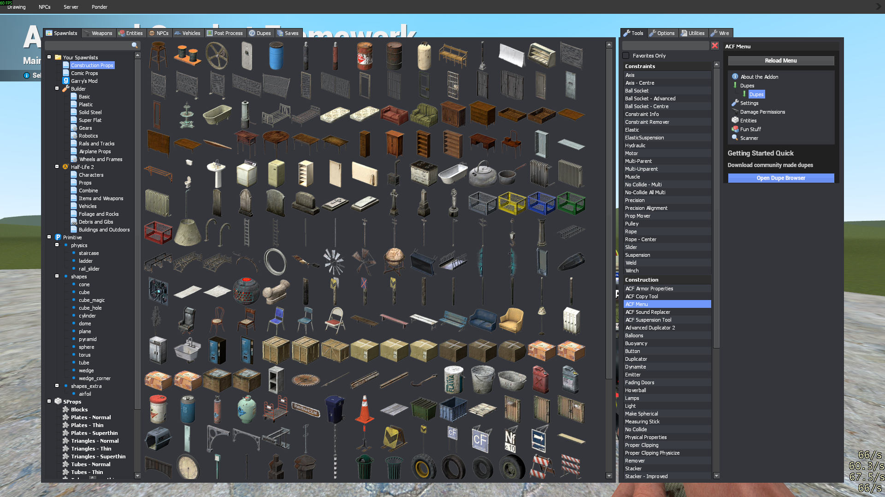
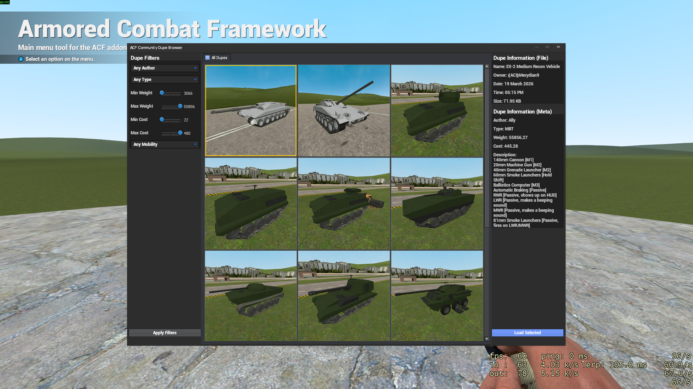

{: .notice}
ACF-3 Provides a built in dupe browser that has public dupes curated by the ACF-3 devs.
We check to make sure they are as safe and optimized as possible.

After you spawn in game:
1. Press `Q`
2. Equip the ACF menu tool
    
3. Click on "Dupes" -> "Dupes"
4. Click "Open Dupe Browser"
    
5. Adjust the options on the left if applicable
6. Left click on a dupe of your choice
7. Click "Load Selected" and you will be switched to the Advanced Duplicator 2 tool.
8. After waiting for the dupe to load, left click to spawn it.
9. Enjoy