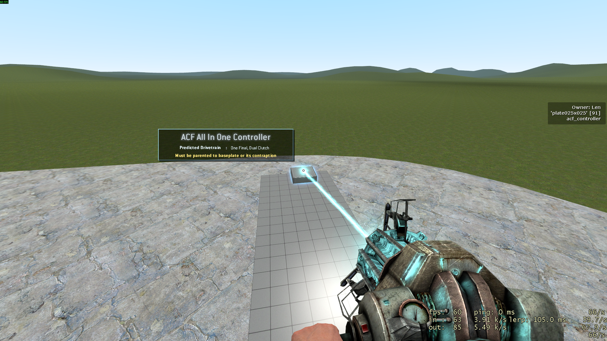
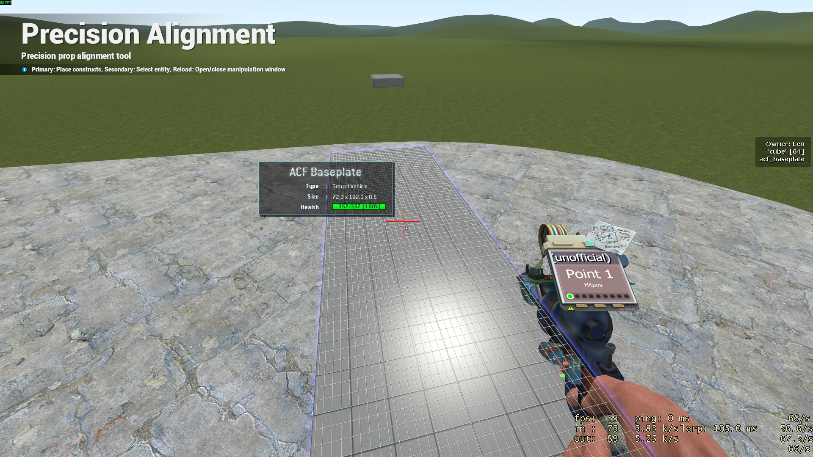
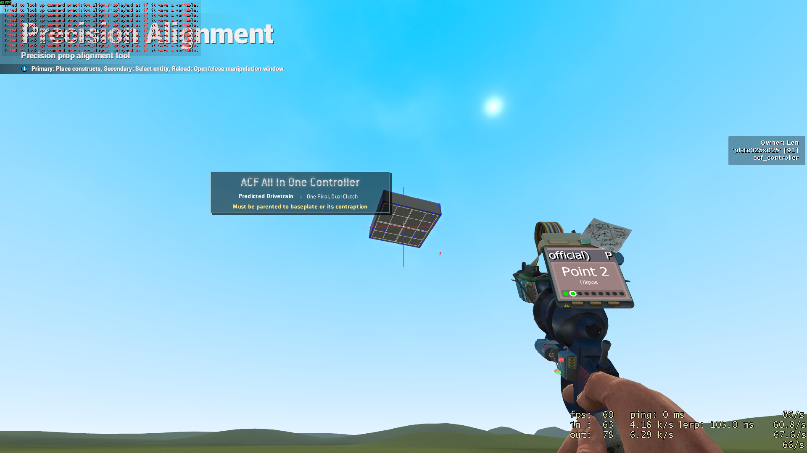
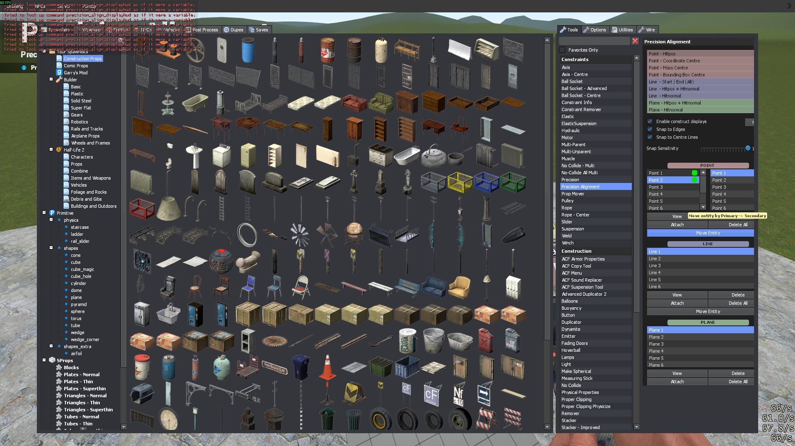
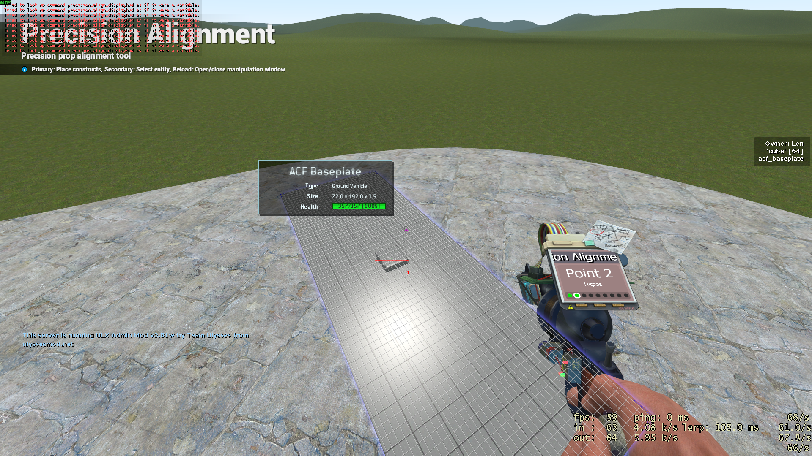

# Precision Alignment
Precision Alignment helps you move and align props in a precise way. 

Using `SHIFT + E` and moving your mouse, try aligning your controller with your baseplate.

Next, select the Precision Alignment tool from the menu (from the constraints category).

Left click near the center of the baseplate. A cross should appear and be snapped to the center.

Move underneath the AIO Controller and `SHIFT + LEFT CLICK` it. Similarly, a second cross should appear and be snapped to the center.

Right click the controller, open the menu and click "move entity":

The AIO controller should be moved on top of the baseplate very precisely:

This is just a basic demonstration of PA; it is capable of much more. This [tutorial](https://www.youtube.com/watch?v=jghzk0ESLOU) goes into more depth.

# Multi-Parent
Multi parent helps you reduce the physics and networking cost of many entities by making them "follow" others.

# Advanced Duplicator 2