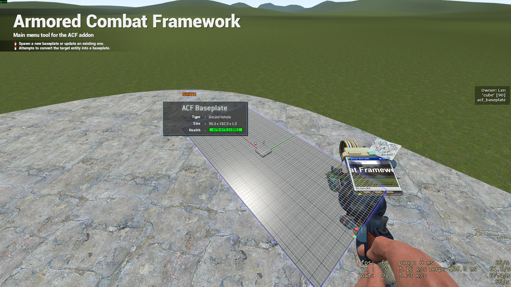

# Updating
Select the baseplate menu and change the size in the menu to be 96 wide, 192 long and 1 thick.

Look at the baseplate entity and left click. This should update the baseplate by resizing it:

All ACF entities support updating existing entities with different options.

# Engines

# Fuel

# Gearboxes

# Gearing

# Wheels

# AIO