# Updating Entities
Select the baseplate menu and change the size in the menu to be 96 wide, 192 long and 1 thick.

Look at the baseplate entity and `LEFT CLICK`. This should update the baseplate by resizing it:

All ACF entities support updating existing entities with different options.

# Engines

{: .notice}
If it helps, [Review Multi-Parent](basic_tools.html/#multi-parent).

Engines power your vehicle. Larger engines are generally more powerful but take up more space.

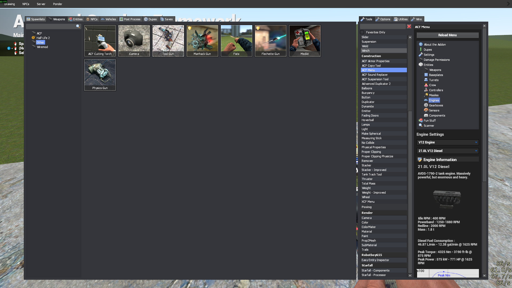

The top dropdown is the engine type. Select "V12 Engine".
The bottom dropdown is the engine model. Select "21.0L V12 Diesel".

# Fuel
Engines require fuel to function.

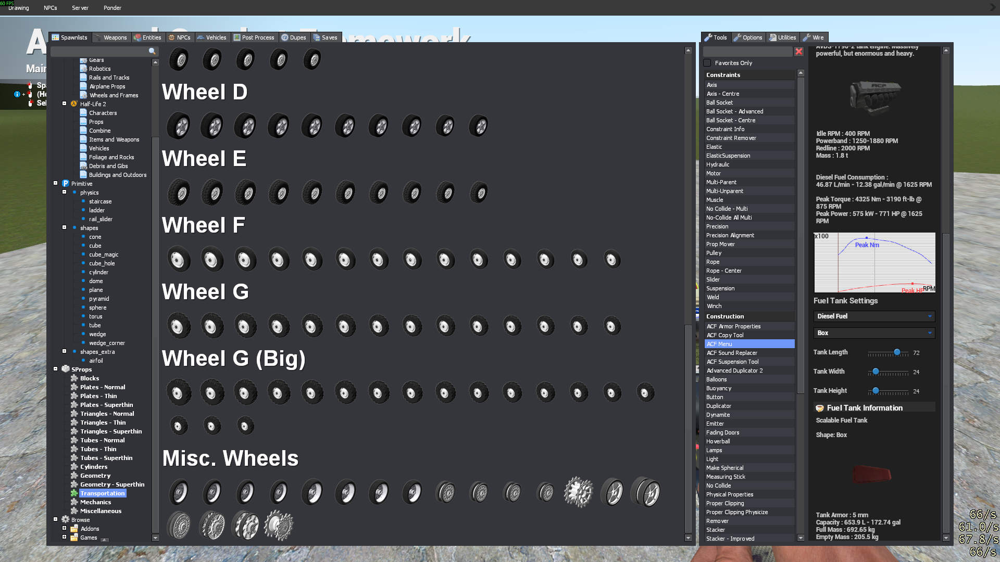

Scroll down in the engine menu and select a 72x24x24 fuel tank. Spawn two and move them like so.

`SHIFT + RIGHT CLICK` the two fuel tanks and then `RIGHT CLICK` the engine to link them together.

# Gearboxes
Gearboxes transfer power from the engine to the wheels.

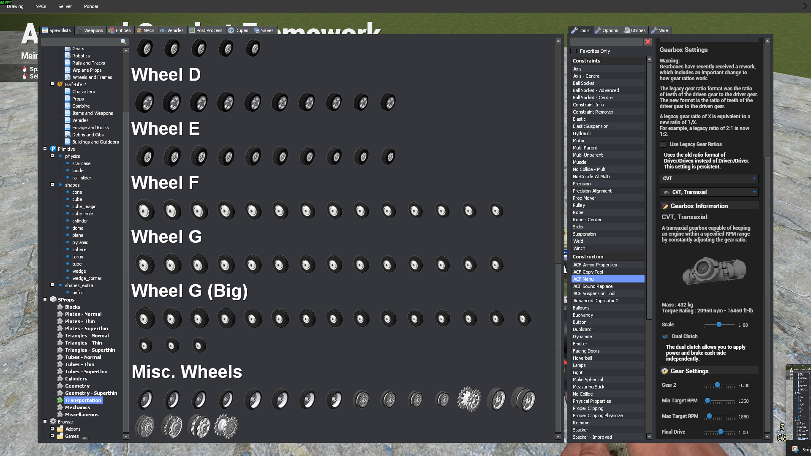

Select a transaxial CVT with these settings.

# Wheels

{: .notice}
If it helps, [Review Precision Alignment](basic_tools.html/#precision-alignment).

Tanks have treads, but in gmod we have to cope with wheels.

Navigate to `models/sprops/trans/miscwheels/tank30.mdl` and spawn 3 wheels.

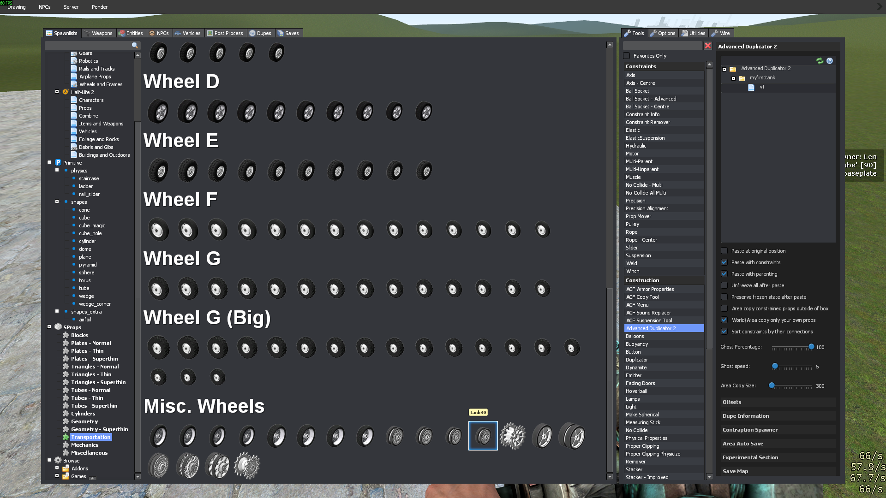

Using PA, move a wheel to the middle of your baseplate. Then move the other 2 wheels to the corners.

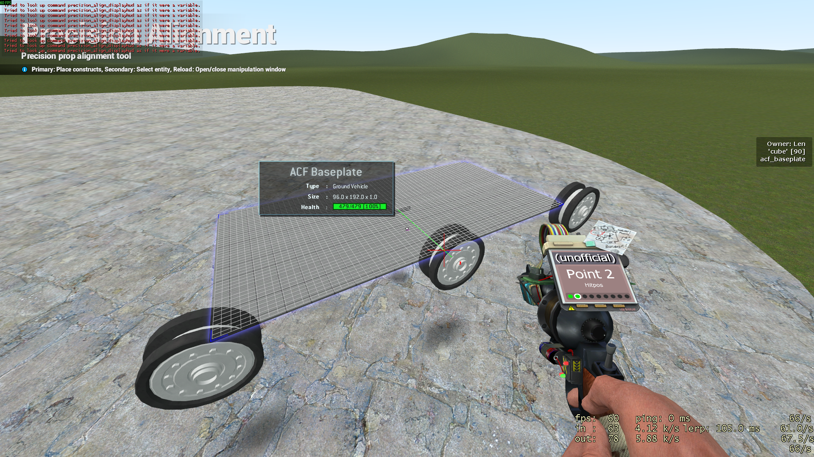

Now select "Plane - HitPos + HitNormal" from the PA tool menu.

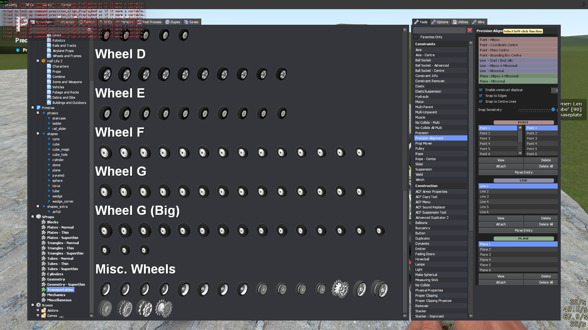

`LEFT CLICK` to place a plane on the center of the baseplate.

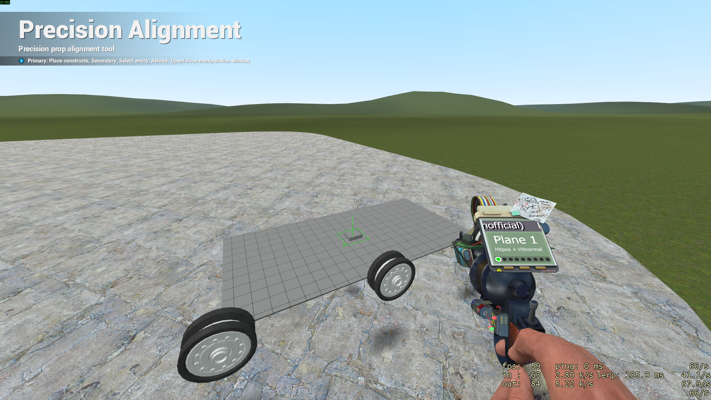

Next, select "HitNormal" and `LEFT CLICK` the map wall such that the plane "cuts" along the length of the baseplate.

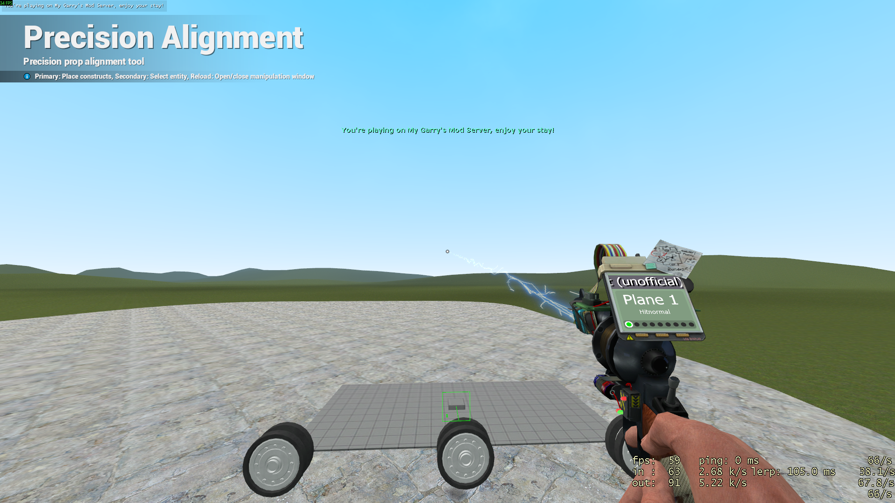

`RIGHT CLICK` the front wheel to select it.

Press `R` to open the advanced menu, select "Rotation Functions" and select "Mirror Across Plane".

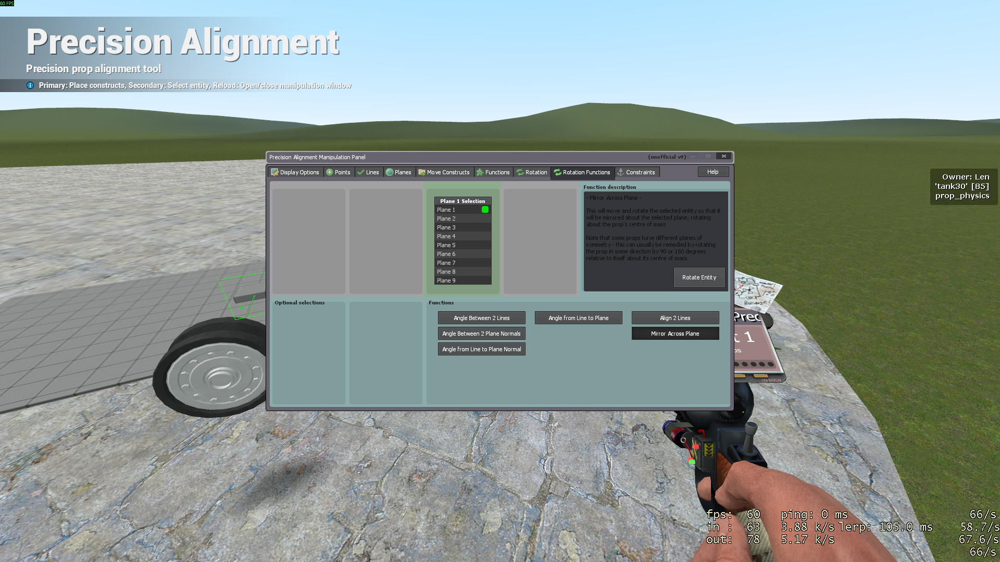

Next, select "Plane 1" and `SHIFT + LEFT CLICK` the "Rotate Entity" button.

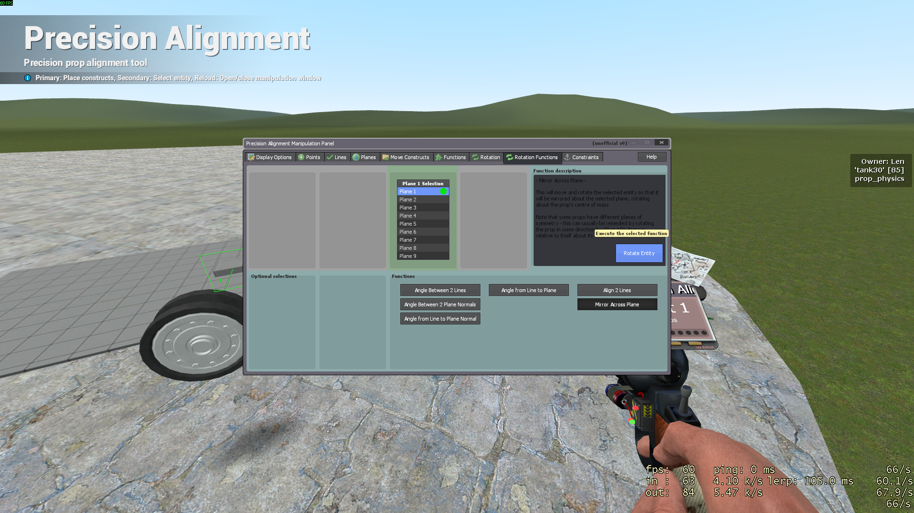

This "Mirrors" the wheel to the other side of the tank. Do the same for the other two wheels.

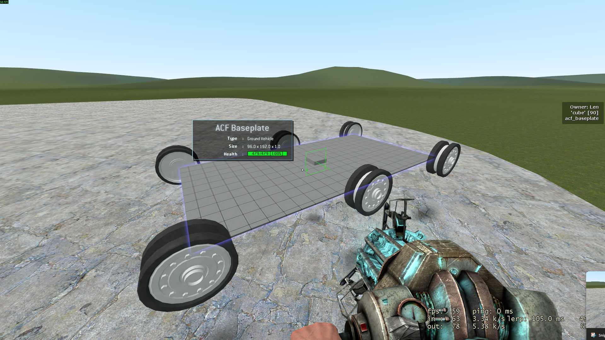