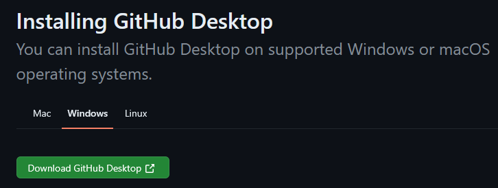
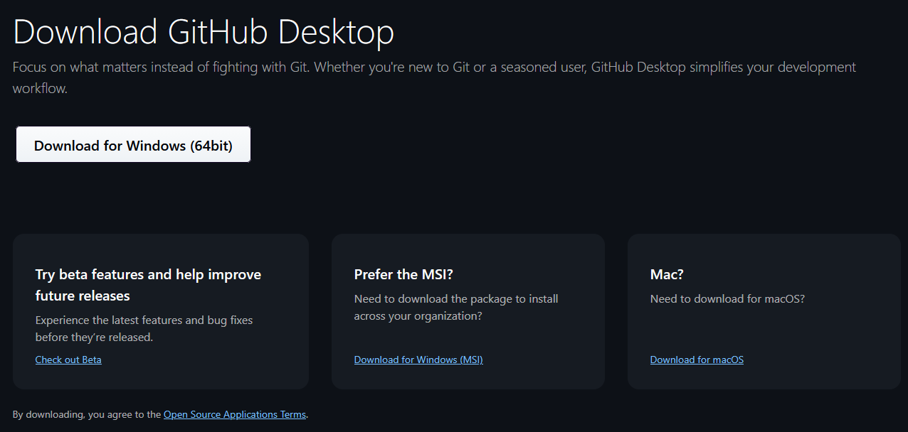
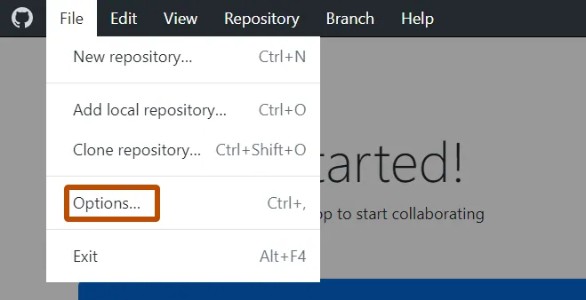
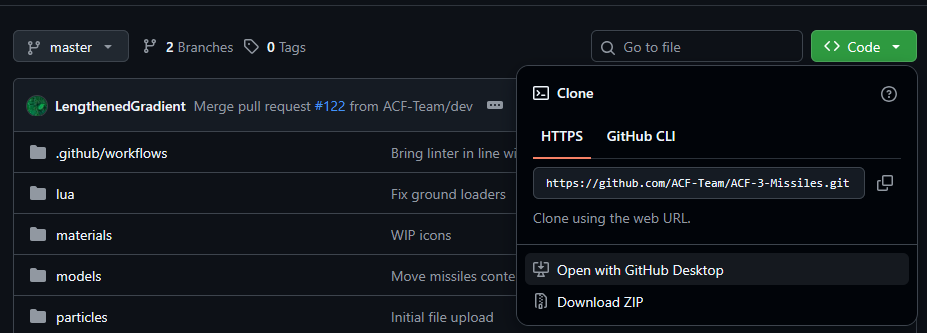
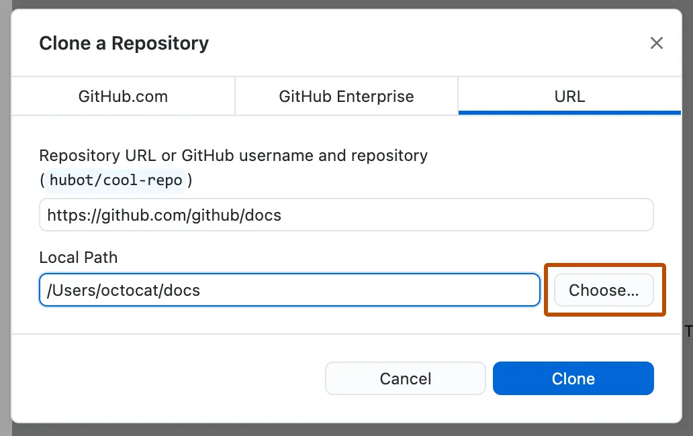
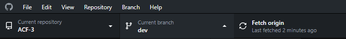
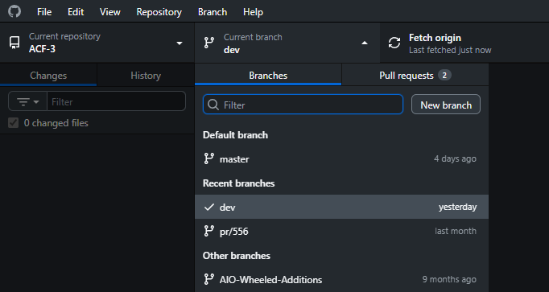

{: .highlight }
We recommend you use this option if you would like to test the `dev` branch.
`dev` tends to be less stable (sometimes has bugs), but changes we make are immediate.

{: .highlight }
You will need to [create a GitHub Account](https://docs.GitHub.com/en/get-started/start-your-journey/creating-an-account-on-GitHub) unless you already have one.

# What is GitHub Desktop?
"GitHub Desktop is a free, open source application that helps you to work with code hosted on GitHub or other Git hosting services."

# Installing GitHub Desktop
Visit the [official download link](https://docs.GitHub.com/en/desktop/installing-and-authenticating-to-GitHub-desktop/installing-GitHub-desktop), follow these links and download the version for your Operating System.

# Authenticating your GitHub Account
1. In the menu bar, select **GitHub Desktop**, then click **Settings**.

   
2. In the "Settings" window, on the **Accounts** pane, click the appropriate "Sign Into" button. Use **Sign Into GitHub Enterprise** to sign into GitHub Enterprise Server or GitHub Enterprise Cloud with data residency.

   
3. If you are signing into an account on GitHub Enterprise, in the "Sign in" modal window, type the URL where you access GitHub, then click **Continue**.
4. In the "Sign in Using Your Browser" modal window, click **Continue With Browser**. GitHub Desktop will open your default browser.
5. To authenticate to GitHub, in the browser, type your credentials and click **Sign in**.

# Cloning The ACF-3 Repository
1. Navigate to the [ACF-3 GitHub repository](https://github.com/ACF-Team/ACF-3) and select "Open With Github Desktop"

2. Choose your gmod addons folder (should be somewhere like `C:\Program Files (x86)\Steam\steamapps\common\GarrysMod\garrysmod\addons\ACF-3`)

# Updating your ACF-3 instance
1. Click on the "Fetch Origin" button.
    
2. If there are updates, a download icon should appear. Click on it and confirm to download the changes.

# Switching branches
1. Select the "current branch" dropdown and select your branch of choice
    