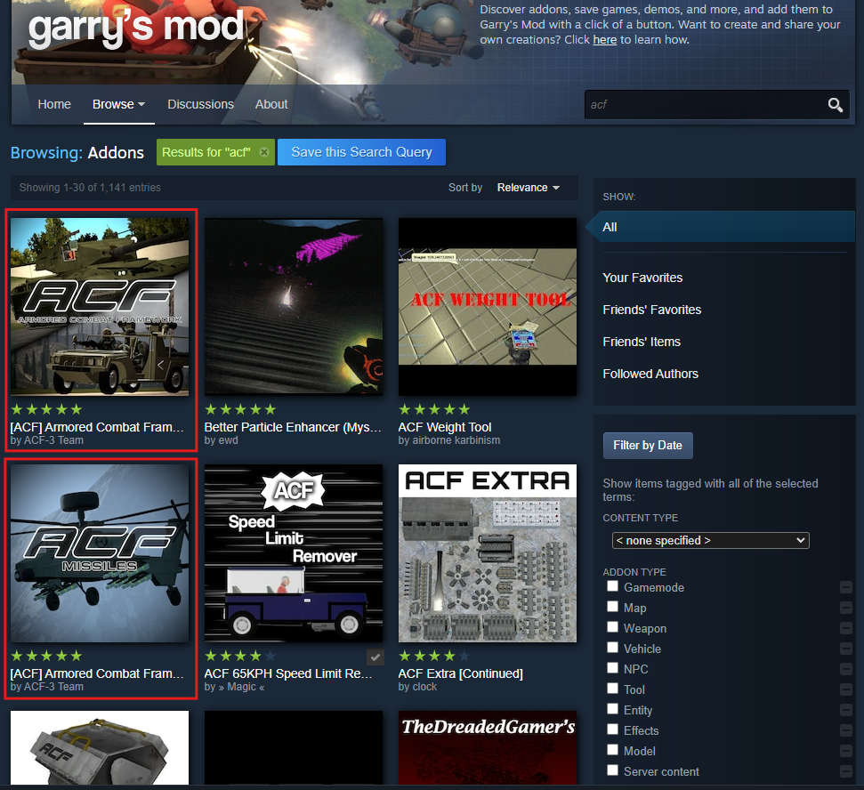
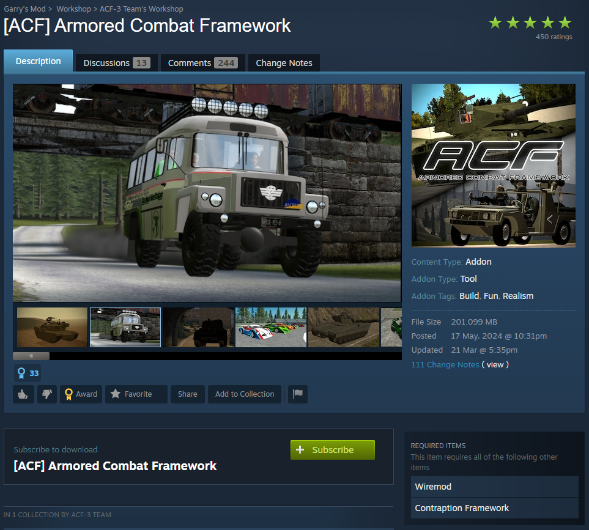

{: .notice }
If you are just trying to get started, this is the fastest option.
This is only updated from our `main` branch.
`main` tends to be more stable, but updates are much slower.

You can find [ACF-3](https://steamcommunity.com/sharedfiles/filedetails/?id=3248769144) and [ACF-3-Missiles](https://steamcommunity.com/sharedfiles/filedetails/?id=3248769787) on the workshop by searching up "acf" in the search bar:

Click on the addon and then click "Subscribe":

When asked to install "Wiremod" or "Contraption Framework", press "Yes".