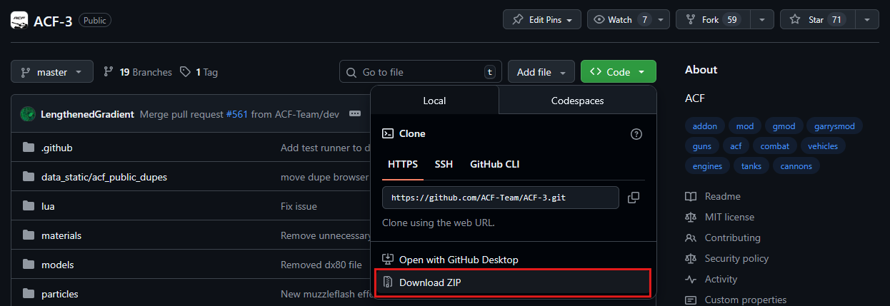

{: .warning }
Please only use this option if you are trying to use a branch other than `main` like `dev`.
You will need to re-download the zip file if an update happens or if you switch branches.
For these reasons we strongly recommend using GitHub Desktop for this.

Navigate to the ACF-3 GitHub Repository and click on the `<Code>` dropdown. Then click "Download Zip"

